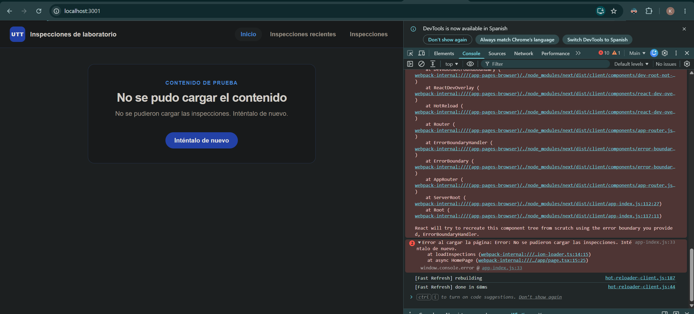
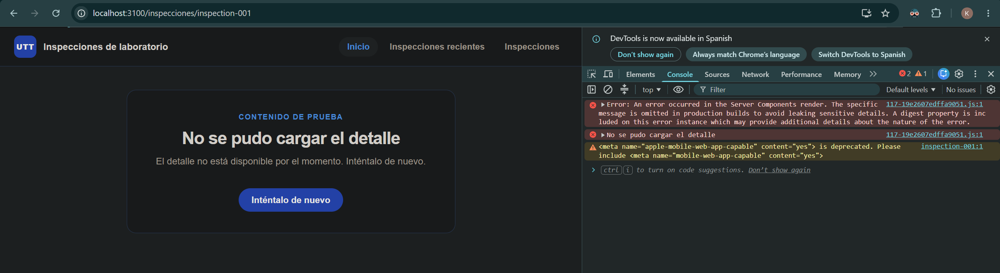
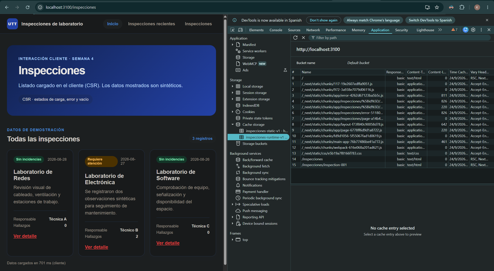
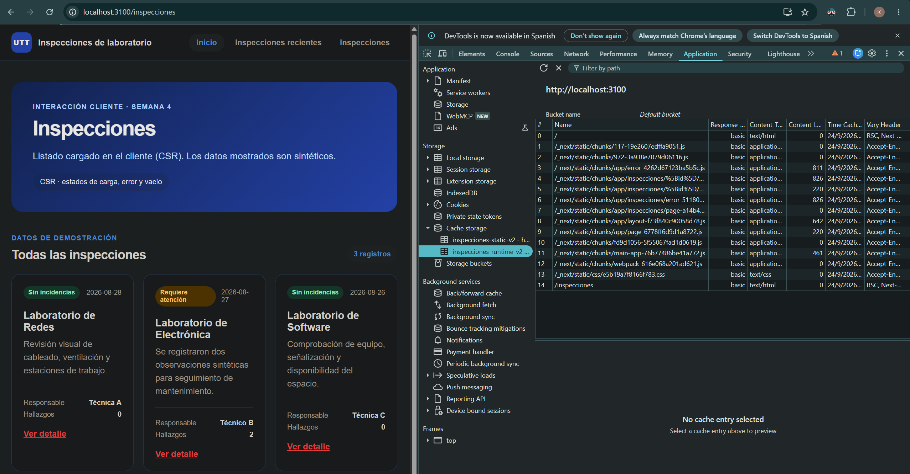
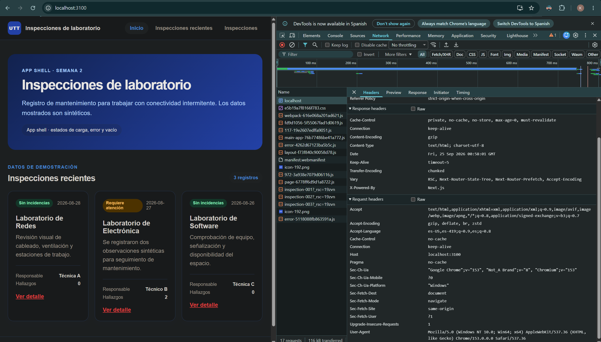
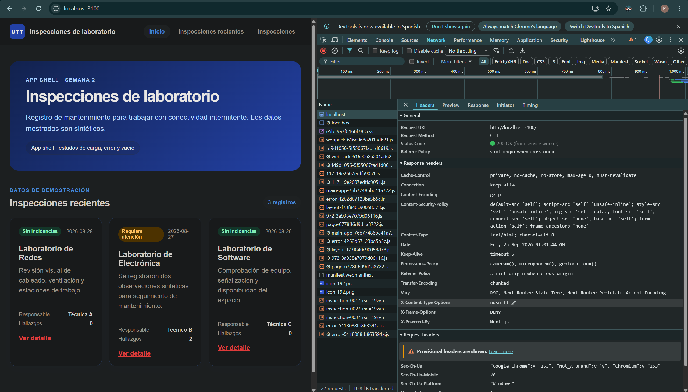

# Auditoría de seguridad — Semana 4

**Integrante:** Montalvo Marcial Kevin Armando (10A-E08)
**Proyecto:** pwa-inspecciones-10A-E08
**Rama:** `week4/security-audit-kevin`
**Fecha:** 24 de septiembre de 2026

Esta auditoría sigue el proceso: **encontrar un problema → explicar por qué representa
un riesgo → corregirlo → demostrar que quedó corregido**. Todos los datos utilizados son
sintéticos y no se publica ninguna credencial real.

## Hallazgos

| # | Hallazgo | Riesgo | Solución aplicada | Evidencia |
|---|---|---|---|---|
| 1 | Los componentes de error mostraban el mensaje del error al usuario y registraban el objeto `Error` completo en consola | Información interna del proyecto (rutas y detalles de fallas) podía quedar visible en pantalla y en los registros de consola | Se muestran mensajes genéricos y se registra solo una etiqueta, sin el objeto `Error` ni su pila | `error-antes.png` y `error-despues.png` |
| 2 | La caché de runtime del Service Worker guardaba cada página visitada sin límite alguno | El almacenamiento del dispositivo podía crecer sin control y acumular copias viejas de páginas | Se acota la caché runtime a 24 entradas con eliminación de la más antigua (`MAX_RUNTIME_ENTRIES`) y se publica la versión v2 del worker | `sw-cache-antes.png` y `sw-cache-despues.png` |
| 3 | El servidor no enviaba cabeceras HTTP de seguridad (CSP, `X-Content-Type-Options`, `X-Frame-Options`, etc.) en las respuestas | Navegadores con protección reducida ante contenido mixto, clickjacking y otros ataques básicos | Se añadieron cabeceras de seguridad para todas las rutas en `next.config.mjs` | `headers-antes.png` y `headers-despues.png` |

---

## Hallazgo 1 — Mensajes de error con información interna visibles en pantalla y consola

### Problema encontrado

Los tres componentes de error de la aplicación registraban en consola el objeto `Error`
completo y mostraron su mensaje tal cual:

- `src/app/error.tsx` (error general)
- `src/app/inspecciones/error.tsx` (error del listado)
- `src/app/inspecciones/[id]/error.tsx` (error del detalle)

En los tres casos el código hacía `console.error("<contexto>:", error)`, que imprime el
mensaje **y la pila de llamadas (stack)** con rutas internas del proyecto, y la pantalla
rendía `{error.message}` sin ningún tipo de filtro.

### Riesgo

Los mensajes de error detallados podían quedar visibles para cualquier persona en la
consola del navegador y en la pantalla. Si una falla llegara a contener datos internos
(direcciones de servicios, rutas de archivos o identificadores), esa información serviría
para entender cómo está construido el proyecto y para buscar otros puntos débiles. Además,
mostrar detalles internos a un usuario final no aporta información útil para él.

### Solución

Se quitaron los datos técnicos de la pantalla y de la consola:

- La consola solo registra una etiqueta fija que indica qué sección falló.
- La pantalla muestra un mensaje genérico para que el usuario reintente.
- El botón "Inténtalo de nuevo" se conserva.

### Antes

```tsx
useEffect(() => {
  console.error("Error en el detalle:", error);
}, [error]);

// ...
<p>{error.message}</p>
```

### Después

```tsx
useEffect(() => {
  console.error("No se pudo cargar el detalle");
}, [error]);

// ...
<p>El detalle no está disponible por el momento. Inténtalo de nuevo.</p>
```

### Evidencia

Antes: la consola exponía el objeto `Error` con su pila de ejecución.


Después: el error sigue ocurriendo (se simuló a propósito), pero la consola solo muestra
la etiqueta fija y la pantalla un mensaje general, sin detalles internos.


---

## Hallazgo 2 — Caché de runtime del Service Worker sin límite

### Problema encontrado

En `public/sw.js`, la estrategia de navegación guardaba en
`inspecciones-runtime-v1` **todas** las páginas visitadas y los recursos públicos
solicitados, sin un tope de entradas. Cada visita nueva se sumaba a la caché y
nada la eliminaba:

```js
async function fetchAndCache(request) {
  const response = await fetch(request);
  if (response.ok) {
    const cache = await caches.open(RUNTIME_CACHE);
    await cache.put(request, response.clone());
  }
  return response;
}
```

### Riesgo

Como la aplicación no tiene límite de páginas (cada inspección es una ruta
distinta), el almacenamiento del dispositivo crecía sin control con copias de
páginas ya visitadas. En equipos con poco espacio o con muchas visitas, esto
podía llenar la cuota del navegador, degradar el rendimiento y conservar copias
viejas de contenido que ya no debían mostrarse.

### Solución

Se acotó la caché de runtime a un máximo de `MAX_RUNTIME_ENTRIES = 24` entradas.
Al guardar una respuesta que supera el tope, se elimina la entrada más antigua
(la primera en orden de inserción). El precache de la shell no cambia: su tamaño
lo define la aplicación. Además se publicó la versión `v2` del worker, que al
activarse limpia las cachés `v1` anteriores.

```js
const MAX_RUNTIME_ENTRIES = 24;

async function trimToMax(cache) {
  const keys = await cache.keys();
  const excess = keys.length - MAX_RUNTIME_ENTRIES;
  if (excess <= 0) return;
  await Promise.all(keys.slice(0, excess).map((key) => cache.delete(key)));
}
```

### Evidencia

Antes: `inspecciones-runtime-v1` acumulaba las URLs de las páginas visitadas sin
ningún límite.


Después: la caché runtime pasa a `inspecciones-runtime-v2`, las `v1` se eliminan
al activar la nueva versión y el límite queda respaldado por una prueba que
verifica que con 26 respuestas la caché queda en 24 entradas, eliminando las más
antiguas.


---

## Hallazgo 3 — El servidor no enviaba cabeceras HTTP de seguridad

### Problema encontrado

La configuración de `next.config.mjs` solo definía `Cache-Control` para `/sw.js`.
Las respuestas del resto de la aplicación no incluían cabeceras de seguridad como
`Content-Security-Policy`, `X-Content-Type-Options` o `X-Frame-Options`. Al
inspeccionar los encabezados de una página en el navegador solo aparecían
`Content-Type`, `Cache-Control` y `X-Powered-By: Next.js`.

### Riesgo

Sin estas cabeceras, el navegador aplica comportamientos permisivos por omisión:
- Sin `X-Content-Type-Options: nosniff`, un navegador puede interpretar un
  archivo con un tipo declarado incorrecto (por ejemplo, ejecutar contenido como
  script), lo que facilita ataques como *content sniffing*.
- Sin `X-Frame-Options` ni `frame-ancestors`, la aplicación puede incrustarse en
  un marco de un sitio ajeno (*clickjacking*).
- Sin `Referrer-Policy`, los enlaces pueden enviar la URL completa de origen al
  salir de la aplicación, filtrando rutas internas.
- Sin `Content-Security-Policy`, nada limita qué orígenes pueden cargar scripts,
  estilos o imágenes, y no hay forma de detectar contenido inyectado.

### Solución

Se añadieron cabeceras de seguridad para todas las rutas en `next.config.mjs`:

```js
{
  source: "/:path*",
  headers: [
    { key: "X-Content-Type-Options", value: "nosniff" },
    { key: "X-Frame-Options", value: "DENY" },
    { key: "Referrer-Policy", value: "strict-origin-when-cross-origin" },
    { key: "Permissions-Policy", value: "camera=(), microphone=(), geolocation=()" },
    { key: "Content-Security-Policy", value: "default-src 'self'; ... frame-ancestors 'none'" }
  ]
}
```

La CSP mantiene `'unsafe-inline'` para scripts y estilos porque Next.js hidrata la
aplicación con scripts inline; el resto queda restringido a `'self'`. La app se
verificó en producción después del cambio y sigue funcionando (páginas, listado,
detalle y el Service Worker).

### Evidencia

Antes: la respuesta del servidor solo traía encabezados generales, sin ninguna
cabecera de seguridad.


Después: la misma respuesta incluye `Content-Security-Policy`, `X-Content-Type-Options`,
`X-Frame-Options`, `Referrer-Policy` y `Permissions-Policy`.


Respaldo programático (salida de `Invoke-WebRequest`): `headers-antes.txt` y
`headers-despues.txt`.